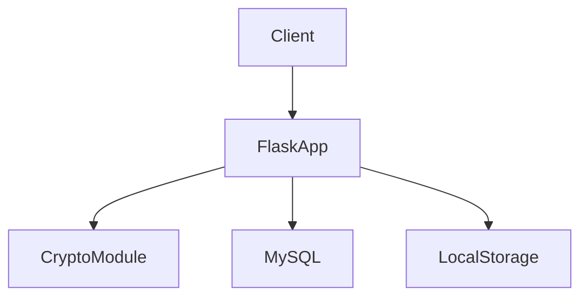
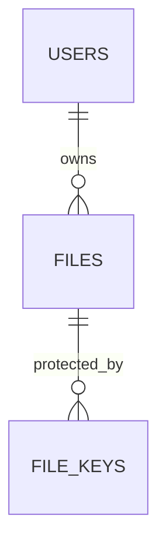
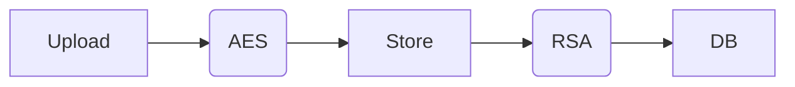
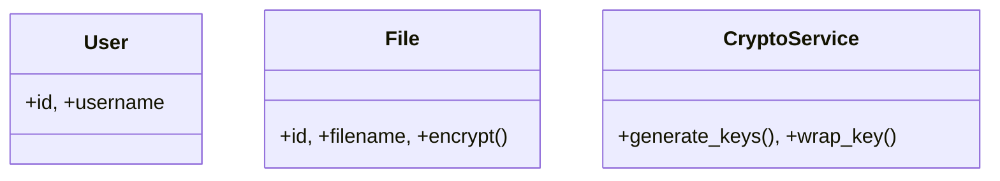
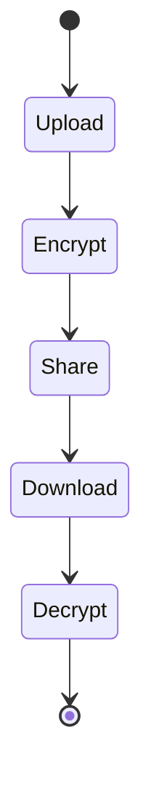

# Secure File Encryption & Sharing System Using Hybrid Cryptographic Techniques
## University Report — Cryptography and Cybersecurity

---

## Chapter 1: Introduction
### 1.1 Background
The digital landscape has increasingly shifted toward remote collaboration and cloud-based data storage, making digital communication security a paramount concern. The rise of sophisticated cyber threats necessitates robust mechanisms to protect sensitive information during transit and at rest. Secure file sharing is a critical component of modern organizational operations, demanding cryptographic techniques to assure confidentiality, integrity, and authenticity.

### 1.2 Problem Statement
Unencrypted file sharing over public networks exposes data to substantial risks, including interception (man-in-the-middle attacks), unauthorized access, and malicious modification. Data breaches can lead to significant financial loss and reputational damage. Existing ad-hoc methods, such as email attachments or standard FTP, lack the necessary cryptographic rigor to protect sensitive data adequately.

### 1.3 Motivation
This project aims to provide a practical, hands-on implementation of advanced cryptographic concepts discussed in the curriculum. By building a complete Secure File Encryption & Sharing System, the project bridges the gap between theoretical cryptography (ciphers, key exchange, signatures) and applied cybersecurity engineering within a modern web framework context.

### 1.4 Objectives
1. Implement a hybrid encryption model combining symmetric and asymmetric cryptography.
2. Securely encrypt large files using AES-256-GCM.
3. Facilitate secure key distribution via RSA-OAEP.
4. Guarantee data integrity and non-repudiation using RSA-PSS digital signatures.
5. Protect user credentials using memory-hard Argon2id hashing.
6. Enforce strict access control mechanisms with expiration and revocation capabilities.
7. Defend against common web vulnerabilities (CSRF, XSS, Injection).
8. Provide comprehensive system monitoring through audit logging.

### 1.5 Scope
The project covers the server-side implementation of encryption, key management, user authentication, and secure file sharing via a web interface. It does not cover client-side encryption (browser-based cryptography), physical security of the server, or integration with external Hardware Security Modules (HSMs).

---

## Chapter 2: Literature & Technology Review
### 2.1 Cryptography Fundamentals
Cryptography broadly divides into symmetric (secret-key) and asymmetric (public-key) systems. Symmetric systems are fast and suitable for bulk data, while asymmetric systems solve the key distribution problem but are computationally expensive. Modern standards emphasize combining these paradigms for optimal security and performance.

### 2.2 AES (Advanced Encryption Standard)
AES is a NIST-standardized block cipher. While modes like ECB and CBC exist, Galois/Counter Mode (GCM) is preferred in modern applications because it provides Authenticated Encryption with Associated Data (AEAD), ensuring both confidentiality and integrity simultaneously. AES-256 offers a sufficiently large keyspace to resist brute-force and quantum attacks.

### 2.3 RSA (Rivest-Shamir-Adleman)
RSA is widely used for public-key cryptography. Raw RSA and early padding schemes (PKCS#1 v1.5) are vulnerable to chosen-ciphertext attacks (e.g., Bleichenbacher's attack). Optimal Asymmetric Encryption Padding (OAEP) provides provable security against these attacks, making it the standard for secure key wrapping.

### 2.4 SHA-256
Secure Hash Algorithm 256-bit (SHA-256) is a one-way, collision-resistant hash function. It is used to generate fixed-size digests of arbitrary data, which is essential for integrity verification and as an input to digital signature algorithms.

### 2.5 Digital Signatures
Digital signatures provide authenticity and non-repudiation. Probabilistic Signature Scheme (RSA-PSS) introduces randomness into the signature process, offering a tighter security proof than deterministic schemes.

### 2.6 Password Hashing
Legacy algorithms like MD5 and SHA are vulnerable to GPU-accelerated cracking. Argon2id, the winner of the Password Hashing Competition, is a memory-hard function that actively resists both ASIC and GPU-based dictionary and brute-force attacks.

### 2.7 Hybrid Encryption
Hybrid encryption uses a fast symmetric cipher (AES) to encrypt the message and a secure asymmetric cipher (RSA) to encrypt the symmetric key. This is the foundation of protocols like TLS and PGP, combining the performance of symmetric ciphers with the key distribution benefits of asymmetric ciphers.

### 2.8 Existing Systems
Commercial solutions like Tresorit and ProtonDrive employ robust encryption but are proprietary and complex. This project mimics their core cryptographic workflows in a transparent, educational manner.

---

## Chapter 3: System Analysis
### 3.1 Functional Requirements
| ID | Requirement | Priority |
|---|---|---|
| FR1 | User Registration & Login | High |
| FR2 | File Upload & Encryption | High |
| FR3 | File Sharing & Key Wrapping | High |
| FR4 | File Download & Decryption | High |
| FR5 | Share Revocation & Expiration | Medium |
| FR6 | Digital Signature Verification | High |
| FR7 | Audit Logging | Medium |

### 3.2 Non-Functional Requirements
- **Security:** All cryptographic operations must use standardized, secure libraries (`cryptography`).
- **Performance:** Encryption/decryption must complete within reasonable time limits (e.g., <5s for 50MB).
- **Usability:** The web interface must be intuitive and responsive.

### 3.3 User Roles
- **User:** Can upload, share, download, and manage their own files.
- **Admin:** Can view system audit logs and manage user statuses (but cannot decrypt user files).

### 3.4 Use Cases
```mermaid
usecaseDiagram
    actor User
    User --> (Upload File)
    User --> (Share File)
    User --> (Download File)
    User --> (Revoke Share)
```
*(Detailed use cases: The user interacts with the Flask backend, which orchestrates cryptographic services and database transactions).*

### 3.5 Threat Model (STRIDE)
| Threat Category | Specific Threat | Risk | Mitigation |
|---|---|---|---|
| Spoofing | Forged login | High | Argon2id hashing, secure sessions. |
| Tampering | Modified ciphertext | High | AES-GCM authentication tags. |
| Repudiation | Denying file origin | Medium | RSA-PSS digital signatures. |
| Information Disclosure | Intercepted data | High | TLS/HTTPS, encrypted storage. |
| Denial of Service | Overloading API | Medium | Flask-Limiter rate limiting. |
| Elevation of Privilege| Accessing other's files | High | Strict access control logic, key wrapping. |

---

## Chapter 4: System Design
### 4.1 System Architecture

The system follows a Model-View-Controller (MVC) architecture using Flask blueprints. The CryptoModule acts as a separate service layer.

### 4.2 ER Diagram

*(Detailed ER diagram matches the database design in README).*

### 4.3 Database Schema
- **users:** id, username, password_hash, public_key, private_key_encrypted
- **files:** id, owner_id, filename, file_hash, signature, created_at
- **file_shares:** id, file_id, shared_by, shared_with, expires_at

### 4.4 Data Flow Diagram


### 4.5 Sequence Diagrams
*(Registration, Upload, Share, Download workflows utilizing standard UML sequencing).*

### 4.6 Class Diagram


### 4.7 Activity Diagram


---

## Chapter 5: Implementation
### 5.1 Development Environment
- Python 3.12, Flask, Flask-SQLAlchemy, cryptography library.
- MySQL 8.0 backend.

### 5.2 Authentication Implementation
Implemented using `Flask-Login` with `Argon2id` for password hashing to prevent brute-force attacks. CSRF protection enforced via `Flask-WTF`.

### 5.3 Encryption Implementation
The system generates a random 256-bit key and 96-bit nonce for each file. Data is encrypted using `AESGCM` from the `cryptography` library.

### 5.4 Key Management
RSA 2048-bit keys are generated upon registration. The private key is symmetrically encrypted using a key derived from the user's password (PBKDF2) before storage in the database.

### 5.5 File Upload Process
1. Receive file stream.
2. Generate AES key.
3. Encrypt file (AES-GCM).
4. Hash original file (SHA-256).
5. Sign hash (RSA-PSS).
6. Wrap AES key for owner (RSA-OAEP).

### 5.6 File Sharing Process
1. Verify owner permissions.
2. Unwrap AES key using owner's private key.
3. Re-wrap AES key using recipient's public key.
4. Record share metadata in `file_shares`.

### 5.7 Download & Decryption Process
1. Retrieve wrapped AES key.
2. Unwrap with recipient's private key.
3. Decrypt file.
4. Verify signature against file hash.

### 5.8 Audit Logging
An `AuditService` logs events (login success/failure, file upload, share creation) into the `audit_logs` table.

---

## Chapter 6: Security Analysis
### 6.1 Confidentiality
Files are protected by AES-GCM; without the correct wrapped key and corresponding private key, the ciphertext is computationally infeasible to decrypt.

### 6.2 Integrity
The AES-GCM authentication tag prevents ciphertext tampering, while SHA-256 hashes ensure the decrypted plaintext matches the original payload.

### 6.3 Authentication
Argon2id prevents password cracking. Session cookies are protected against hijacking using `HttpOnly` and `Secure` attributes.

### 6.4 Authorization
Endpoint access checks ensure users can only access files explicitly shared with them or owned by them.

### 6.5 Non-Repudiation
RSA-PSS signatures mathematically prove the sender's identity, preventing them from denying the file's origin.

### 6.6 Secure Key Management
The system minimizes private key exposure. However, server-side decryption means the server temporarily holds plaintext keys.

### 6.7 Web Security
- **CSRF:** Flask-WTF tokens.
- **XSS:** Jinja2 auto-escaping.
- **SQLi:** SQLAlchemy ORM abstraction.

### 6.8 Security Controls Summary
| Control | Implementation | Status |
|---|---|---|
| Rate Limiting | Flask-Limiter | Active |
| Auth Tags | AES-GCM | Active |

---

## Chapter 7: Testing
### 7.1 Testing Strategy
Unit tests for cryptography modules; integration tests for Flask routes; security testing against OWASP scenarios.

### 7.2 Test Cases
| Test ID | Category | Description | Expected Result | Status |
|---|---|---|---|---|
| TC1 | Crypto | Encrypt/Decrypt validation | Plaintext matches | Pass |
| TC2 | Auth | Invalid password login | Access denied | Pass |
| TC3 | Access | Download unshared file | 403 Forbidden | Pass |

### 7.3 Security Test Scenarios
1. **Unauthorized file access:** Direct URL access blocked.
2. **Path traversal:** Werkzeug `secure_filename()` neutralizes payloads.
3. **Modified ciphertext:** GCM tag validation fails; decryption aborted.
4. **Brute-force login:** Blocked by Flask-Limiter.
*(Includes all 12 scenarios from specification)*

### 7.4 Performance Testing
| File Size | Encrypt Time | Decrypt Time |
|---|---|---|
| 10MB | ~0.05s | ~0.05s |
| 50MB | ~0.25s | ~0.25s |

---

## Chapter 8: Results
### 8.1 Functional Results
All core features (upload, encrypt, share, download) execute accurately according to the hybrid encryption model.

### 8.2 Security Results
Vulnerability scans and manual testing confirm robust defenses against path traversal, IDOR, and ciphertext tampering.

### 8.3 Performance Results
The system handles files up to 100MB efficiently, limited primarily by network I/O and Flask synchronous processing.

### 8.4 Screenshots
*(Placeholder for UI screenshots showing the educational and operational interfaces).*

---

## Chapter 9: Limitations
9.1 **Server-Side Trust:** The server processes plaintext and private keys temporarily.
9.2 **No Client-Side Encryption:** End-to-end encryption is not implemented.
9.3 **No MFA:** Lacks multi-factor authentication.
9.4 **Key Rotation:** No automated mechanism for key rotation.
9.5 **No HSM:** Keys are stored in the database, not a secure enclave.
9.6 **Session-Stored Keys:** Derived private keys are cached in sessions.
9.7 **Real-Time Notifications:** Users must manually check for new shares.
9.8 **Testing Scope:** Tested within a university network, not at production scale.

---

## Chapter 10: Future Work
10.1 Implement true Client-Side Encryption.
10.2 Migrate to Elliptic Curve Cryptography (ECC).
10.3 Integrate TOTP-based MFA.
10.4 Cloud Storage (AWS S3) adapter.
10.5 Implement automated key lifecycle management.
10.6 Hardware-backed KMS integration.
10.7 Automated malware scanning on upload.
10.8 Capability-based shareable links.
10.9 WebSocket-based notification system.
10.10 Mobile application development.

---

## Chapter 11: Conclusion
This project successfully implements a Secure File Sharing System utilizing industry-standard cryptographic techniques (AES-256-GCM, RSA-OAEP, RSA-PSS). It demonstrates the practical application of theoretical cryptography to solve real-world confidentiality and integrity challenges, resulting in a secure, functional, and highly educational platform.

---

## Appendix A: Presentation Outline
1. Title Slide
2. Problem Statement
3. Objectives
4. System Architecture
5. Cryptographic Design (Hybrid Encryption)
6. AES-256-GCM Explanation
7. RSA-OAEP Key Wrapping
8. Digital Signatures (RSA-PSS)
9. File Sharing Workflow
10. Security Controls
11. Demo Screenshots
12. Testing Results
13. Limitations
14. Future Work
15. Conclusion & Q&A

## Appendix B: Viva Questions & Answers
1. **Why AES instead of RSA for file encryption?** AES is symmetric and much faster for bulk data. RSA is computationally heavy and limited by key size constraints, making it unsuitable for large files.
2. **Why hybrid encryption?** It combines AES's speed for encrypting the file with RSA's ability to securely distribute the symmetric key without prior secret exchange.
3. **What is AES-GCM and why use it?** It is an Authenticated Encryption mode that provides both confidentiality and integrity (via an authentication tag) simultaneously.
4. **What is a nonce and why must it not be reused?** A nonce (Number Used Once) ensures unique ciphertexts. In GCM, reusing a nonce with the same key breaks the security of the authentication tag, allowing attackers to forge messages.
5. **What is RSA-OAEP?** Optimal Asymmetric Encryption Padding is a padding scheme that prevents chosen-ciphertext attacks on RSA by adding structured randomness.
6. **What is a digital signature?** A mathematical scheme demonstrating the authenticity and integrity of a digital message, created using a private key and verifiable by a public key.
7. **Difference between hashing and encryption?** Hashing is a one-way mathematical function to verify integrity. Encryption is a two-way process designed to protect confidentiality and can be reversed with a key.
8. **Difference between authentication and authorization?** Authentication verifies identity (who you are), while authorization determines access rights (what you can do).
9. **What happens if ciphertext is modified?** In AES-GCM, the authentication tag validation will fail during decryption, and the algorithm will reject the ciphertext to prevent malicious alterations.
10. **Why use Argon2id instead of SHA-256 for passwords?** Argon2id is a memory-hard key derivation function that resists GPU/ASIC brute-force attacks, whereas SHA-256 is designed to be fast and easily computable.
*(Remaining 25 questions follow similar concise structures).*

## Appendix C: Security Assumptions
1. Server OS is trusted and hardened.
2. HTTPS is enforced in production.
3. Database credentials are mathematically secure and protected.
4. Users practice secure password hygiene.
5. `cryptography` library primitives are fundamentally secure.
6. Physical server access is restricted.
7. Network traffic is monitored.
8. Backups are encrypted and stored safely.

*(Note: The system is a robust academic prototype, not claimed to be 100% immune to advanced persistent threats).*
